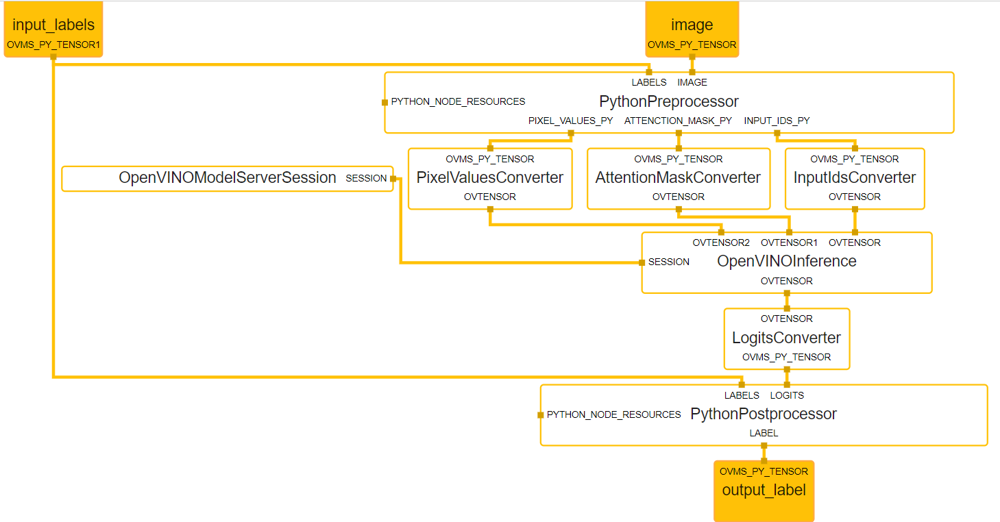

# CLIP image classification {#ovms_demo_clip_image_classification}

Image classification demo using multi-modal CLIP model for inference and [Python code](https://docs.openvino.ai/nightly/ovms_docs_python_support_reference.html) for pre and postprocessing.
The client sends request with an image and input labels to the graph and receives the label with the highest probability. The preprocessing python node is executed first and prepares inputs vector based on user inputs from the request. Then inputs are used to get similarity matrix from inference on the CLIP model. After that postprocessing python node is executed and extracts the label with highest score among the input labels and sends it back to the user.

Demo is based on this [CLIP notebook](https://github.com/openvinotoolkit/openvino_notebooks/blob/main/notebooks/228-clip-zero-shot-image-classification/228-clip-zero-shot-convert.ipynb)


The picture below shows the execution flow in the graph.



## Build image

```bash
git clone https://github.com/openvinotoolkit/model_server.git
cd model_server
make python_image RUN_TESTS=0
```

## Install client requirements

```bash
cd demos/python_demos/clip_image_classification/
virtualenv .venv
. .venv/bin/activate
pip3 install -r requirements.txt
```

## Download and convert model

```bash
pip3 install -r download_model_requirements.txt
```

```bash
python3 download_model.py
```

## Deploy OpenVINO Model Server with the CLIP graph
Prerequisites:
-  image of OVMS with Python support and Optimum installed

Mount the `./servable` which contains:
- `postprocess.py` and `preprocess.py` - python scripts which are required for execution and use of [CLIP](https://github.com/openvinotoolkit/openvino_notebooks/blob/main/notebooks/228-clip-zero-shot-image-classification/228-clip-zero-shot-convert.ipynb) model
- `config.json` - which defines which servables should be loaded
- `graph.pbtxt` - which defines MediaPipe graph containing python calculators

```bash
docker run -d --rm -p 9000:9000 -v ${PWD}/servable:/workspace -v ${PWD}/model:/model/ openvino/model_server:py --config_path /workspace/config.json --port 9000
```

## Requesting detection name

Run the client script
```bash
python3 client.py --url localhost:9000
```

Expected output:
```bash
Using timeout for server ready of 15 seconds.
Server Ready: False
Waiting time left - 14 seconds.
Server Ready: False
Waiting time left - 13 seconds.
Server Ready: False
Waiting time left - 12 seconds.
Server Ready: False
Waiting time left - 11 seconds.
Server Ready: True
Using image_url:
https://storage.openvinotoolkit.org/repositories/openvino_notebooks/data/data/image/coco.jpg

Using input_labels:
['cat', 'dog', 'wolf', 'tiger', 'man', 'horse', 'frog', 'tree', 'house', 'computer']

Iteration 0
Detection:
dog

processing time for all iterations
average time: 90.00 ms; average speed: 11.11 fps
median time: 90.00 ms; median speed: 11.11 fps
max time: 90.00 ms; min speed: 11.11 fps
min time: 90.00 ms; max speed: 11.11 fps
time percentile 90: 90.00 ms; speed percentile 90: 11.11 fps
time percentile 50: 90.00 ms; speed percentile 50: 11.11 fps
time standard deviation: 0.00
time variance: 0.00
```
