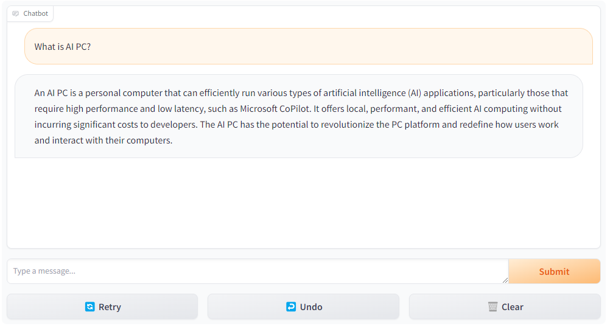

# LLM-powered RAG chatbot serving via Python Calculator in MediaPipe Graph {#ovms_demo_python_rag_chatbot}

This demo shows how to take advantage of OpenVINO Model Server to generate content remotely with LLM models based off given documents.
The demo explains how to serve MediaPipe Graph with Python Calculator. In Python Calculator, we use Hugging Face Optimum with OpenVINO Runtime as execution engine. Entire processing is wrapped inside LangChain Retrieval QA pipeline.

Using the gRPC streaming interactive approach allows the user to read the response as they are getting generated.

This demo presents the use case with [tiny-llama-1b-chat](https://huggingface.co/TinyLlama/TinyLlama-1.1B-Chat-v0.1) model but the included python scripts are prepared for several other LLM models. Those are tiny-llama-1b-chat, llama-2-chat-7b and notus-7b-v1.
In this demo the model can be set by:
```bash
export SELECTED_MODEL=tiny-llama-1b-chat
```

## Requirements
A Linux host with Docker engine installed and sufficient available RAM to load the model and optionally equipped with an Intel GPU card. This demo was tested on a host with Intel® Xeon® Gold 6430 and an Intel® Data Center GPU Flex 170. 
Running the demo with smaller models like `tiny-llama-1b-chat` requires approximately 4GB of available RAM.

## Build image

Building the image with all required python dependencies is required. Follow the commands to build RedHat image:

```bash
git clone https://github.com/openvinotoolkit/model_server.git
cd model_server
make python_image BASE_OS=redhat OVMS_CPP_DOCKER_IMAGE=registry.connect.redhat.com/intel/openvino-model-server OVMS_CPP_IMAGE_TAG=2024.0
```
It will create an image called `registry.connect.redhat.com/intel/openvino-model-server:py`

You can also build Ubuntu 22.04 image:
```
make python_image BASE_OS=ubuntu OVMS_CPP_DOCKER_IMAGE=openvino/model_server OVMS_CPP_IMAGE_TAG=2024.0
```
It will create an image called `openvino/model_server:py`


## Download LLM model

Download the model using `download_model.py` script:

```bash
cd demos/python_demos/rag_chatbot
pip install -r requirements.txt

python download_model.py --help
INFO:nncf:NNCF initialized successfully. Supported frameworks detected: torch, onnx, openvino
usage: download_model.py [-h] --model
                         {tiny-llama-1b-chat,red-pajama-3b-chat,llama-2-chat-7b,mpt-7b-chat,qwen-7b-chat,chatglm3-6b,mistral-7b,zephyr-7b-beta,neural-chat-7b-v3-1,notus-7b-v1,youri-7b-chat}

Script to download LLM model based on https://github.com/openvinotoolkit/openvino_notebooks/blob/main/notebooks/254-llm-chatbot

optional arguments:
  -h, --help            show this help message and exit
  --model {tiny-llama-1b-chat,red-pajama-3b-chat,llama-2-chat-7b,mpt-7b-chat,qwen-7b-chat,chatglm3-6b,mistral-7b,zephyr-7b-beta,neural-chat-7b-v3-1,notus-7b-v1,youri-7b-chat}
                        Select the LLM model out of supported list

python download_model.py --model ${SELECTED_MODEL}

```
The model will appear in `./tiny-llama-1b-chat` directory.

## Weight Compression - optional

[Weight Compression](https://docs.openvino.ai/canonical/weight_compression.html) may be applied on the original model. Applying 8-bit or 4-bit weight compression reduces the model size and memory requirements while speeding up execution by running calculations on lower precision layers.

```bash
INFO:nncf:NNCF initialized successfully. Supported frameworks detected: torch, onnx, openvino
usage: compress_model.py [-h] --model
                         {tiny-llama-1b-chat,red-pajama-3b-chat,llama-2-chat-7b,mpt-7b-chat,qwen-7b-chat,chatglm3-6b,mistral-7b,zephyr-7b-beta,neural-chat-7b-v3-1,notus-7b-v1,youri-7b-chat}

Script to compress LLM model based on https://github.com/openvinotoolkit/openvino_notebooks/blob/main/notebooks/254-llm-chatbot

optional arguments:
  -h, --help            show this help message and exit
  --model {tiny-llama-1b-chat,red-pajama-3b-chat,llama-2-chat-7b,mpt-7b-chat,qwen-7b-chat,chatglm3-6b,mistral-7b,zephyr-7b-beta,neural-chat-7b-v3-1,notus-7b-v1,youri-7b-chat}
                        Select the LLM model out of supported list

python compress_model.py --model ${SELECTED_MODEL}


```
Running this script will create new directories with compressed versions of the model with FP16, INT8 and INT4 precisions.
The compressed models can be used in place of the original as they have compatible inputs and outputs.

```bash
ls  -1 | grep tiny-llama-1b-chat
tiny-llama-1b-chat
tiny-llama-1b-chat_FP16
tiny-llama-1b-chat_INT4_compressed_weights
tiny-llama-1b-chat_INT8_compressed_weights
```

> **NOTE** Applying quantization to model weights may impact the model accuracy. Please test and verify that the results are of acceptable quality for your use case.

> **NOTE** On target devices that natively support FP16 precision (i.e. GPU), OpenVINO automatically adjusts the precision from FP32 to FP16. This improves the performance and typically does not impact accuracy. Original precision can be enforced with `ov_config` key:
`{"INFERENCE_PRECISION_HINT": "f32"}`.

## Download embedding model

Download the model using `download_embedding_model.py` script:

```bash
python download_embedding_model.py --help
usage: download_embedding_model.py [-h] --model {all-mpnet-base-v2,text2vec-large-chinese}

Script to download LLM model based on https://github.com/openvinotoolkit/openvino_notebooks/blob/main/notebooks/254-llm-chatbot

optional arguments:
  -h, --help            show this help message and exit
  --model {all-mpnet-base-v2,text2vec-large-chinese}
                        Select the LLM model out of supported list

python download_embedding_model.py --model all-mpnet-base-v2

```
The model will appear in `./all-mpnet-base-v2` directory.

## Download test documents for knowledge base
We will use single CSV file with [FIFA World Cups information](https://raw.githubusercontent.com/rangelak/fifa-stats/master/data/fifa-world-cup.csv).
```bash
wget -P documents/ https://raw.githubusercontent.com/rangelak/fifa-stats/master/data/fifa-world-cup.csv
```

## Deploy OpenVINO Model Server with Python Calculator

Mount the `./documents` directory with knowledge base.
Mount the `./llm_model` directory with the LLM model.  
Mount the `./embed_model` directory with the document embedding model.  
Mount the servable directory which contains:
- python scripts which are required for execution and use [Hugging Face](https://huggingface.co/) utilities with [optimum-intel](https://github.com/huggingface/optimum-intel) acceleration.
- `config.json` - which defines which servables should be loaded
- `graph.pbtxt` - which defines MediaPipe graph containing python calculator

```bash
docker run -it --rm -p 9099:9099 -v ${PWD}/servable_stream:/workspace -v ${PWD}/${SELECTED_MODEL}:/llm_model \
-v ${PWD}/all-mpnet-base-v2:/embed_model -v ${PWD}/documents:/documents -e SELECTED_MODEL=${SELECTED_MODEL} \
dk_py --config_path /workspace/config.json --port 9099
```

You may deploy the compressed model(s) by simply changing the model path mounted to the container. For example, to deploy the 8-bit weight compressed model:
```bash
docker run -d --rm -p 9000:9000 -v ${PWD}/servable_stream:/workspace -v ${PWD}/${SELECTED_MODEL}_INT8_compressed_weights:/llm_model \
-v ${PWD}/all-mpnet-base-v2:/embed_model -v ${PWD}/documents:/documents -e SELECTED_MODEL=${SELECTED_MODEL} \
registry.connect.redhat.com/intel/openvino-model-server:py --config_path /workspace/config.json --port 9000
```
> **NOTE** Check the Docker container logs to confirm that the model is loaded before sending requests from a client. Depending on the model and hardware it might take a few seconds or several minutes.

> **Note** If order to run the inference load on Intel GPU instead of CPU, just pass the extra parameters to the docker run `--device /dev/dri --group-add=$(stat -c "%g" /dev/dri/render*)`.
It will pass the GPU device to the container and set the correct group security context.

## Run gradio client with gRPC streaming

Install gradio and dependencies:
```bash
pip install -r client_requirements.txt
```
Start the gradio web server:
```bash
python3 app.py --web_url localhost:9001 --ovms_url localhost:9000
```

Visit the website localhost:9001


