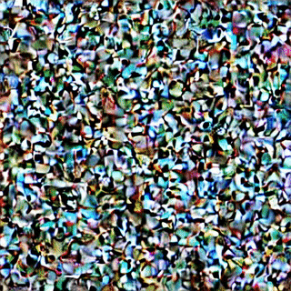

# Stable diffusion demo with python node {#ovms_demo_python_stable_diffusion}

This demo show how to use OpenVINO Model Server to generate images with a stable diffusion pipeline.

The generation cycle is arranged using a MediaPipe graph with Python calculator. In Python Calculator, we use Hugging Face Optimum with OpenVINO Runtime as execution engine.

Here we present two scenarios:
- with unary calls - the client is sending a single prompt to the pipeline and receives a complete generated image
- with gRPC streaming - the client is sending a single prompt and receives a stream of intermediate results to examine the progress

## Build image

Building the image with all required python dependencies is required. Follow the commands:

```bash
git clone https://github.com/openvinotoolkit/model_server.git
cd model_server
make python_image OVMS_CPP_DOCKER_IMAGE=openvino/model_server:latest-gpu
```
It will create an image called `openvino/model_server:py`

> **NOTE** To use the model server compiled from the latest `main` branch, build the base image using the command `make release_image RUN_TESTS=0 GPU=1` and update the parameter `OVMS_CPP_DOCKER_IMAGE` to the generated image name.

## Download models

We are going to use stable-diffusion pipeline in this scenario.  
Download the models using `download_model.py` script:

```bash
cd demos/python_demos/stable_diffusion
pip install -r requirements.txt
python3 download_model.py
```

The models will appear in `./model` directory.

## Generate images with unary calls

### Deploy OpenVINO Model Server with the Python calculator

Run the following command to start OpenVINO Model Server:

```bash
docker run -d --rm -p 9000:9000 -v ${PWD}/servable_unary:/workspace -v ${PWD}/model:/model/ openvino/model_server:py --config_path /workspace/config.json --port 9000
```

Mount the `./model` directory with the model.  
Mount the `./servable_unary` which contains:
- `model.py` and `config.py` - python scripts which are required for execution and use [Hugging Face](https://huggingface.co/) utilities with [optimum-intel](https://github.com/huggingface/optimum-intel) acceleration.
- `config.json` - which defines which servables should be loaded
- `graph.pbtxt` - which defines MediaPipe graph containing python calculator

> **Note** Check the container logs to make sure the container started successfully.

> **Note** If order to run the inference load on Intel GPU instead of CPU, just pass the extra parameters to the docker run `--device /dev/dri --group-add=$(stat -c "%g" /dev/dri/render*)`.
It will pass the GPU device to the container and set the correct group security context.

### Running the client with unary calls

Install client requirements. This step is common for unary and streaming clients:

```bash
pip install -r client_requirements.txt
```

Run client script:
```bash
python3 client_unary.py --url localhost:9000 --prompt "Zebras in space"
Generated image output.png
Total response time: 18.39 s
```


## Generate images with gRPC streaming

### Deploy OpenVINO Model Server with the Python calculator

The use case with gRPC streaming and sending intermediate responses is based on the same models and 
similar implementation of the pipeline.
The key difference is that the execute method in `model.py` has `yield` operator instead of `return`.
It also implements the `callback` function from the `optimum` pipeline to send the results from the generation cycles. A parameter `callback_steps` can deduce the number of responses.

Run the following command to start OpenVINO Model Server:

```bash
docker run -d --rm -p 9000:9000 -v ${PWD}/servable_stream:/workspace -v ${PWD}/model:/model/ openvino/model_server:py --config_path /workspace/config.json --port 9000
```
> **Note** Check the container logs to make sure the container started successfully.

> **Note** If order to run the inference load on Intel GPU instead of CPU, just pass the extra parameters to the docker run `--device /dev/dri --group-add=$(stat -c "%g" /dev/dri/render*)`.
It will pass the GPU device to the container and set the correct group security context.

### Running the client with gRPC stream

Run client script:
```bash
python3 client_stream.py --url localhost:9000 --prompt "Zebras in space"
Executing pipeline
Generated final image image26.png
Transition saved to image.mp4
Total time 24351 ms
Number of responses 26
Average response time: 936.58 ms
```



